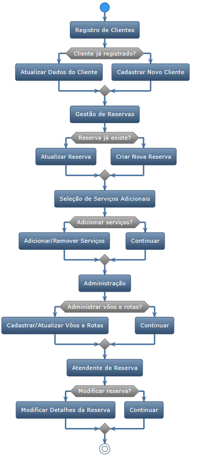

# Diagrama de Atividades
O diagrama de atividades é um tipo de diagrama comportamental usado na modelagem de processos de negócios e na engenharia de software para representar fluxos de trabalho e processos.

## Funcionalidades Principais:

1. **Registro de Clientes**: Os atendentes têm a capacidade de registrar clientes no sistema, mantendo todos os seus detalhes relevantes para futuras reservas.
2. **Gestão de Reservas**: Permitir que atendentes verifiquem e registrem novas reservas, além de visualizar os detalhes de vôos e serviços associados a cada reserva.
3. **Serviços Adicionais**: O sistema deve permitir a seleção, adição ou remoção de serviços adicionais para as reservas, como assentos especiais, refeições e outros.
4. **Administração**: Administradores têm a capacidade de cadastrar novos vôos, rotas e detalhes relevantes ao funcionamento do sistema.
5. **Atendente de Reserva**: Cada reserva é associada a um atendente principal que tem a exclusividade de modificar detalhes dessa reserva.

## Requisitos Não Funcionais:

- **Segurança**: Privacidade e proteção dos dados dos usuários são fundamentais, bem como armazenamento seguro e backups periódicos.
- **Interface**: A usabilidade é uma prioridade, e a interface deve ser intuitiva para atendentes e clientes.
- **Performance**: O sistema deve ser rápido, capaz de suportar múltiplos acessos simultâneos e manter um tempo de resposta otimizado.
- **Disponibilidade**: O sistema deve estar disponível pelo menos 99,9% do tempo, garantindo que clientes e atendentes possam acessá-lo sempre que necessário.
- **Auditabilidade e Compatibilidade**: Todos os processos críticos devem ser rastreáveis, e o sistema deve ser compatível com os principais navegadores e dispositivos.