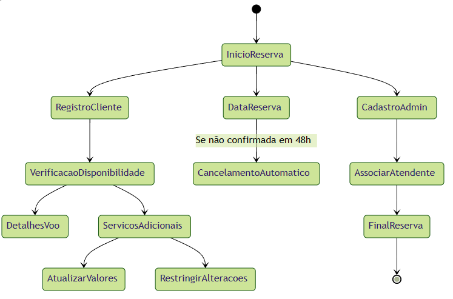

# Diagrama de Estado 

 Diagrama de estado é uma ferramenta de modelagem de software que representa o comportamento de um objeto ou sistema em diferentes estados. 
 Ele é usado para descrever como um objeto ou sistema se comporta em resposta a eventos externos e internos, e como ele muda de um estado para outro. 
 O diagrama de estado é composto por estados, transições, eventos e ações. Os estados representam as condições em que um objeto ou sistema pode existir, as transições representam as mudanças de um estado para outro, os eventos representam as causas das transições e as ações representam as atividades que ocorrem durante as transições. 
 O diagrama de estado é uma ferramenta útil para entender e projetar sistemas complexos, especialmente aqueles que envolvem interações entre diferentes componentes ou estados.

 ### Diagrama de Estado para o Sistema de Reservas
 