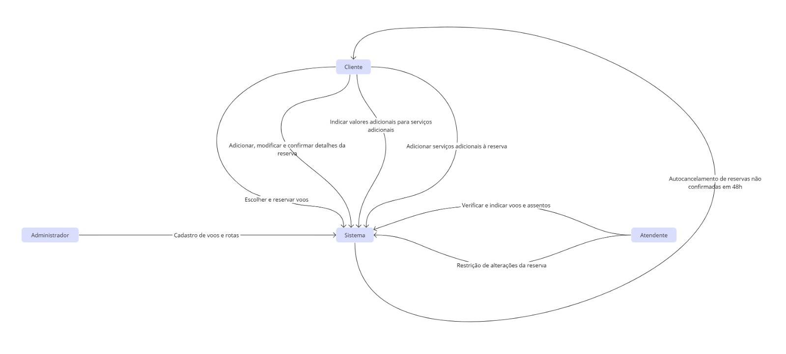

# Diagrama de Contexto

O Diagrama de Contexto oferece uma visualização de alto nível do sistema e suas interações com entidades externas. Ele nos ajuda a entender a fronteira do sistema e as interfaces com outros sistemas ou atores.

A seguir, é apresentada a representação gráfica do Diagrama de Contexto para o sistema de reservas:

Este diagrama destaca as principais entidades que interagem com o sistema e os fluxos de dados entre eles.
