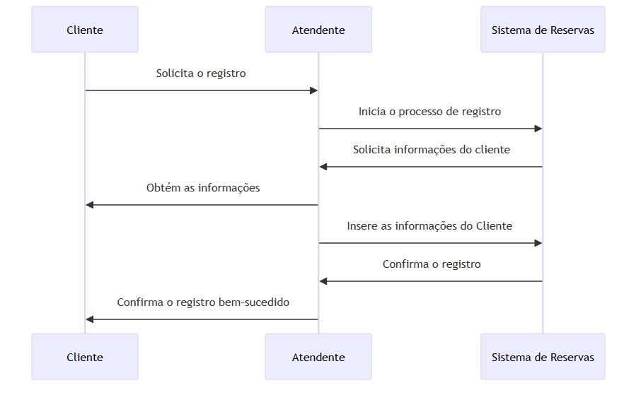
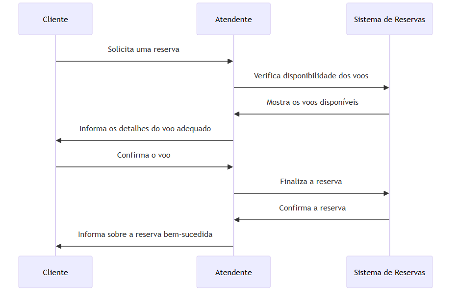
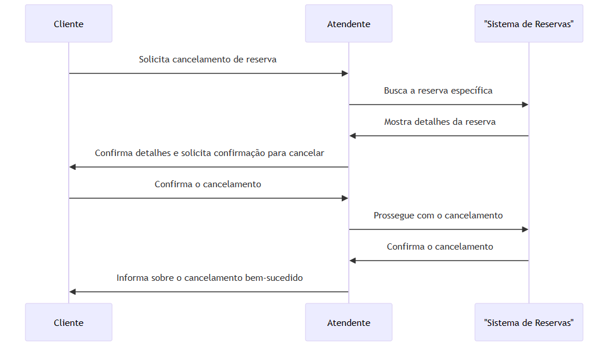

# Diagramas de Sequência

## 1. Registro de Clientes

**Atores**: Cliente, Atendente, Sistema de Reservas.

**Sequência**:
1. O Cliente solicita o registro ao Atendente.
2. O Atendente acessa o Sistema de Reservas e inicia o processo de registro.
3. O Sistema de Reservas solicita informações do cliente.
4. O Atendente obtém e insere as informações do Cliente.
5. O Sistema de Reservas confirma o registro e informa o Atendente.
6. O Atendente confirma o registro bem-sucedido para o Cliente.

---

## 2. Gestão de Reservas

**Atores**: Cliente, Atendente, Sistema de Reservas.

**Sequência**:
1. O Cliente solicita uma reserva ao Atendente.
2. O Atendente acessa o Sistema de Reservas para verificar a disponibilidade dos voos.
3. O Sistema de Reservas mostra os voos disponíveis.
4. O Atendente seleciona o voo adequado e informa os detalhes ao Cliente.
5. O Cliente confirma o voo.
6. O Atendente finaliza a reserva no Sistema de Reservas.
7. O Sistema de Reservas confirma a reserva e informa o Atendente.
8. O Atendente informa o Cliente sobre a reserva bem-sucedida.

---

## 3. Cancelamento de Reservas

**Atores**: Cliente, Atendente, Sistema de Reservas.

**Sequência**:
1. O Cliente solicita o cancelamento de uma reserva ao Atendente.
2. O Atendente acessa o Sistema de Reservas e busca a reserva específica.
3. O Sistema de Reservas mostra os detalhes da reserva.
4. O Atendente confirma com o Cliente os detalhes e solicita confirmação para cancelar.
5. O Cliente confirma o cancelamento.
6. O Atendente prossegue com o cancelamento no Sistema de Reservas.
7. O Sistema de Reservas confirma o cancelamento e informa o Atendente.
8. O Atendente informa o Cliente sobre o cancelamento bem-sucedido.

